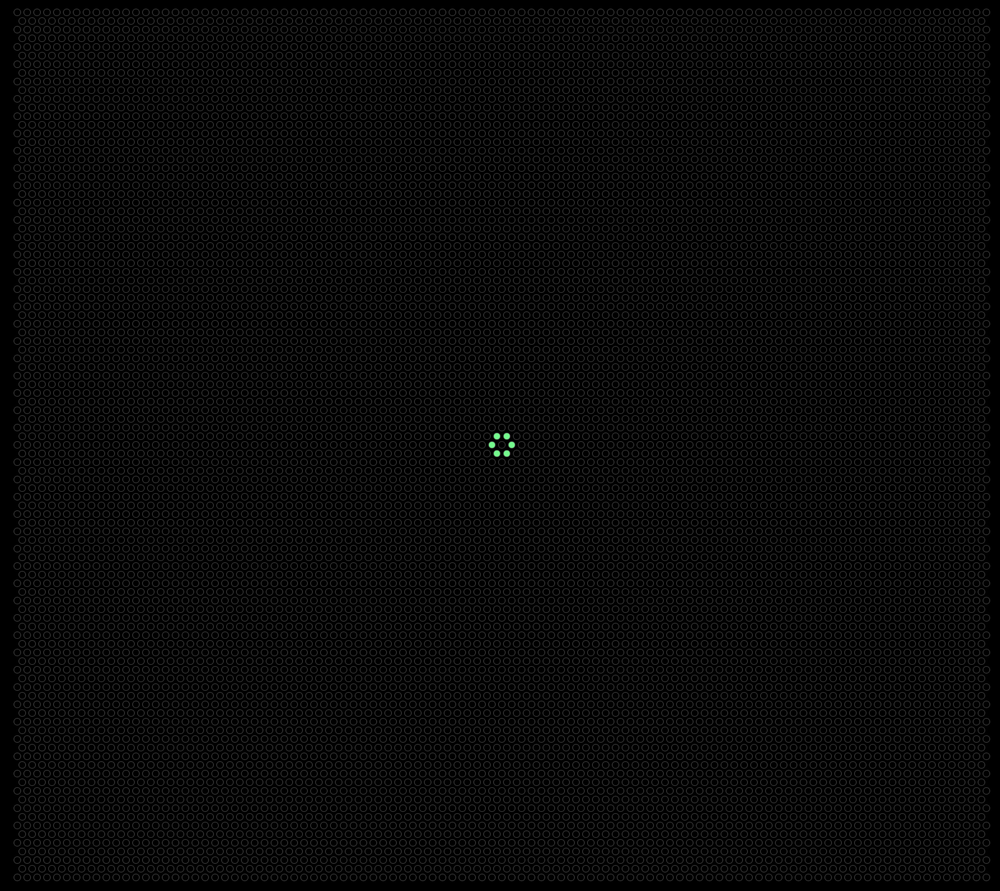
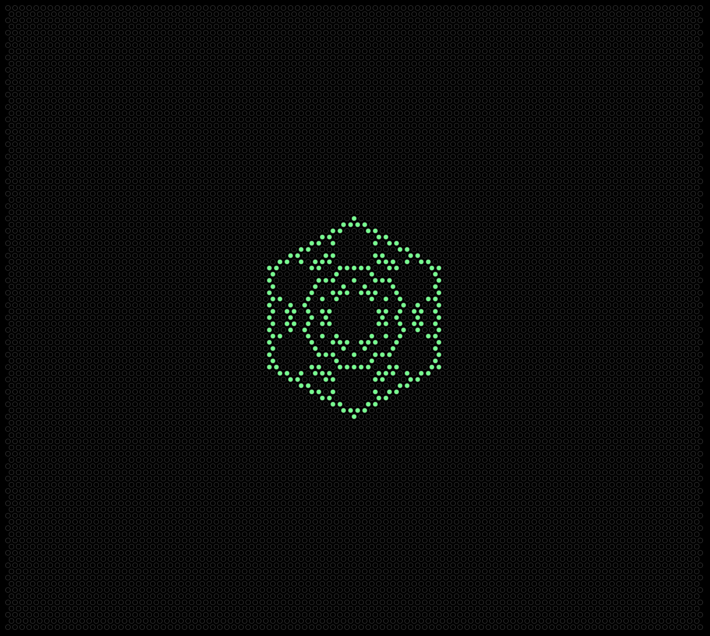
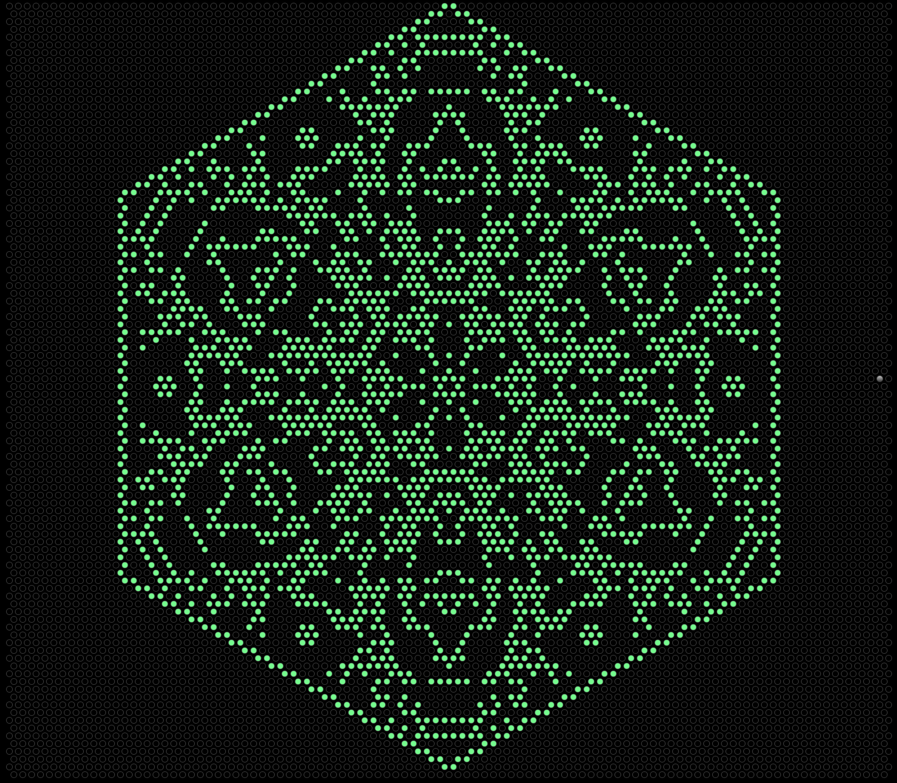

# Game of Life

## Table of Contents
[Project Link](#Link)  
[Technologies](#Technologies)  
[Description](#Description)  
[Screenshots](#Screenshots)  
[License](#License)  
[Contact](#Contact)

## Link
https://dalto135.github.io/game-of-life/

## Technologies
HTML, CSS and Javascript

## Description
A web app that simulates the Game of Life, an algorithm invented by John Horton Conway. Each square is in one of two states: "dead" or "alive". For any given square, whether it will be alive or dead in the next iteration depends on the number of adjacent squares that are alive. If a square is currently dead and it has exactly 3 adjacent squares that are alive, it will become alive in the next iteration. Otherwise, it will remain dead the next iteration. If a square is currently alive and has exactly 2 or 3 adjacent squares alive, it will remain alive the next iteration. Otherwise, it will be dead the next iteration.

The page is currently set so that 2 or 3 adjacent squares are needed regardless of whether the square is currently alive or dead, because this creates interesting results. To watch the algorithm play out, click the button that says "Be". The program is still slow, so it is set to jump to the next iteration every 10 seconds. The "Be" button can be clicked again repeatedly to pause and resume the "game". Individual squares can also be toggled as "dead" or "alive" by the user.

## Screenshots

## License
MIT

## Contact
Dalton Wilkins - daltongh@gmail.com