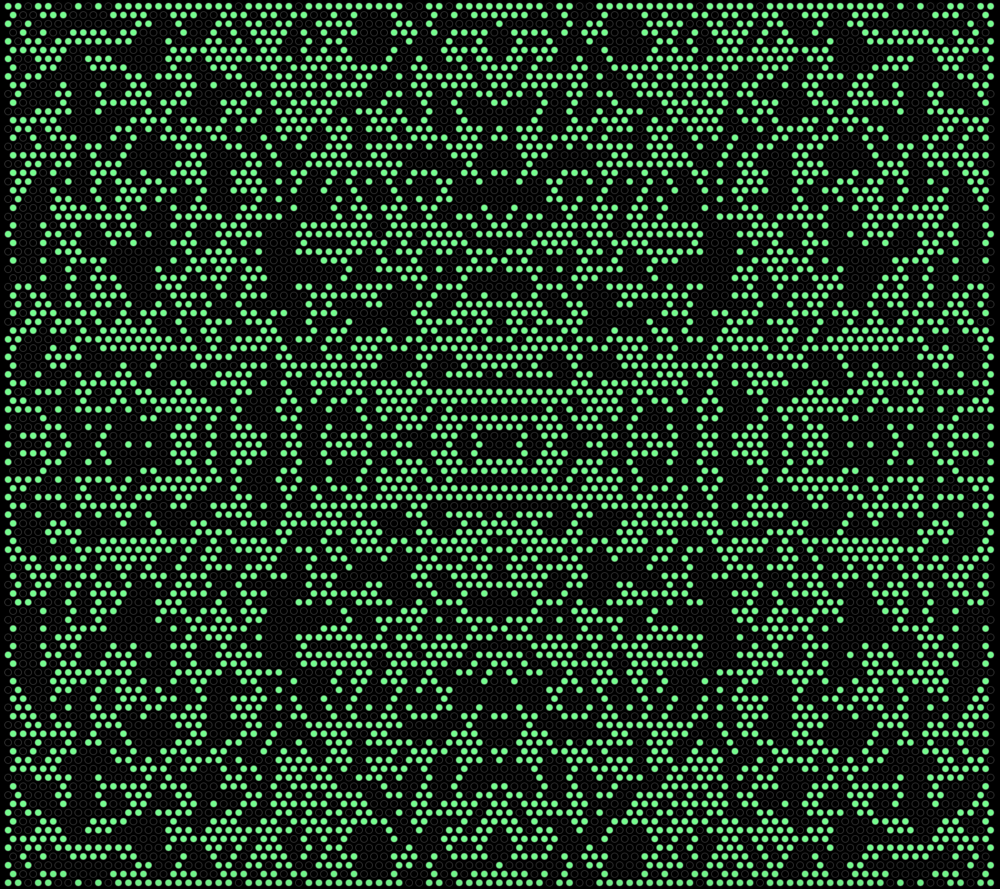

# Game of Life

## Table of Contents
[Project Link](#Link)  
[Technologies](#Technologies)  
[Description](#Description)  
[Screenshots](#Screenshots)  
[License](#License)  
[Contact](#Contact)

## Link
https://dalto135.github.io/game-of-life-hex/

## Technologies
HTML, CSS and Javascript

## Description
A web app that simulates the Game of Life, an algorithm invented by John Horton Conway. Each node is in one of two states: "dead" or "alive". For any given node, whether it will be alive or dead in the next iteration depends on the number of adjacent nodes that are alive. If a node is currently dead and it has exactly 3 adjacent nodes that are alive, it will become alive in the next iteration. Otherwise, it will remain dead the next iteration. If a node is currently alive and has exactly 2 or 3 adjacent nodes alive, it will remain alive the next iteration. Otherwise, it will be dead the next iteration.

The page is currently set so that 2 or 3 adjacent nodes are needed for a node to come alive regardless of whether the node is currently alive or dead, because this creates interesting results. To watch the algorithm play out, click the button that says "Run". The program is still slow, so it is set to jump to the next iteration every 10 seconds. The "Run" button can be toggled to pause and resume the game. The whole grid can be cleared by the user, and individual nodes can be toggled as "dead" or "alive".

## Screenshots

## License
MIT

## Contact
Dalton Wilkins - daltongh@gmail.com